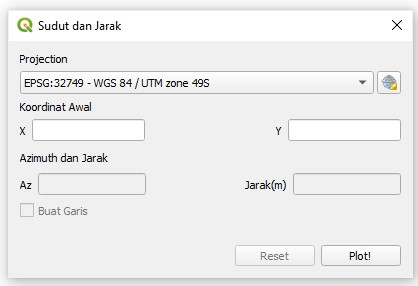

# Plugin QGIS-Jarak

## Tentang Plugin ini
Plugin Sudut-Jarak merupakan plugin yang berguna untuk memploting titik serta garis berdasarkan input dari pengguna .Plugin ini dibuat untuk memenuhi tugas Pemrograman Spasial minggu 7 terkait dengan Pembangunan Aplikasi PyQGIS



## Daftar Fungsi
Fungsi dari plugin ini antara lain:
* Memploting titik berdasarkan input koordinat ,azimuth ,dan jarak dari pengguna
* Memploting garis berdasarkan input koordinat ,azimuth ,dan jarak dari pengguna
* Memilih / menganti sistem koordinat sesuai kebutuhan

## Kontribusi 
Plugin ini dibangun oleh :
* Fungsi penghitung titik kedua berdasarkan input azimuth dan jarak (Sandy Setyanagara ,Fauzan Maulana ,Dwi Larasari Mellin)
* Pengguna memasukkan huruf dan bukan angka untuk kolom jarak maupun azimuth (Sandy Setyanagara ,Fauzan Maulana ,Dwi Larasari Mellin ,Farhan Aji Kumara)
* Pengguna menginginkan untuk merubah sendiri sistem proyeksi dari layer yang dibentuk (Sandy Setyanagara ,Fauzan Maulana)
* Azimuth yang dimasukkan lebih dari 360 derajat (Sandy Setyanagara ,Fauzan Maulana)
* Jarak yang dimasukkan melebihi batas kelengkungan bumi, sehingga tidak sesuai dengan rumus yang digunakan (Farhan Aji Kumara)
* Input pengguna terbalik antara X dan Y (Dwi Larasari Mellin)
* Pengguna ingin agar plugin dapat digunakan untuk plotting Azimuth dan Jarak secara terus menerus, sehingga titik awal akan terupdate dengan titik terakhir yang diperoleh dari hasil hitungan sebelumnya pada saat tombol Plot! ditekan (Sandy Setyanagara)
* Pengguna ingin menggambarkan garis dari titik awal ke titik selanjutnya secara otomatis (Sandy Setyanagara)
* Pembuatan tombol reset (Sandy Setyanagara)
* Pembuatan dialog koordinat hasil input (Sandy Setyanagara)
* Penambahan attribute pada layer (Sandy Setyanagara)

## Lisensi
Lisensi plugin ini berada di bawah naungan **GNU-AGPLv3** sebagai berikut:

```
GNU AGPLv3

Permissions of this strongest copyleft license are conditioned on making available complete source code of licensed works and modifications, which include larger works using a licensed work, under the same license. Copyright and license notices must be preserved. Contributors provide an express grant of patent rights. When a modified version is used to provide a service over a network, the complete source code of the modified version must be made available.
```
